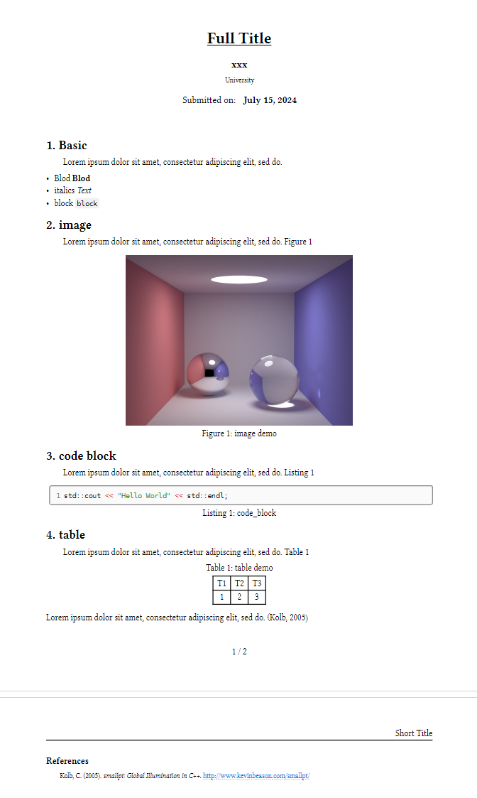

# AssignmentTemplate

A template for assigenment or report
Typst 作业报告模板



引入template模板配置基础信息，其余正常使用

```typst
import template
#import "template.typ": *
#show: template.with(
  title: [Full Title],
  short_title: "Short Title",
  description: [
  ],
  date: datetime(year: 2024, month: 07, day: 15),
  authors: (
    (
      name: "xxx",
    ),
  ),
  affiliations: (
    (id: "1", name: "University"),
  ),
  bibliography_file: "ref.bib",
  paper_size: "a4",
  cols: 1,
  text_font: "XCharter",
  code_font: "Cascadia Mono",
  accent: black, 
)

```

## Demo演示

clone 到本地，使用typst编译。
